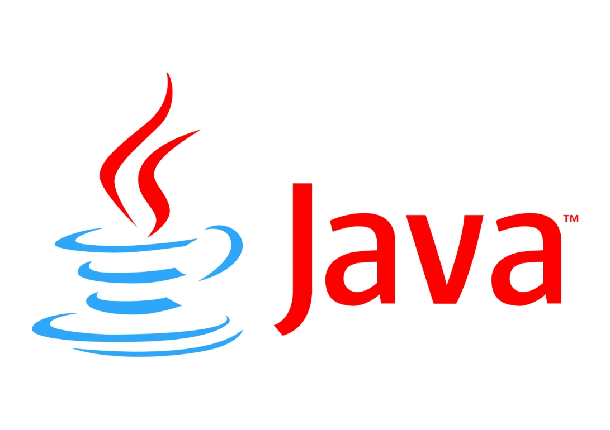

### Java 8'deki yenilikler nelerdir?
Default method, Interface içerisinde gövdeli method tanımlayabilme, yeni derleyici araçları,
Stream API ve DateTime API. 

Bu proje normal Java projesidir, maven projesi değildir. 
Normal proje olarak açınız.
File > Import > General > Existing Project into Workspace > İlgili klasörü seçin > Tamam.!
